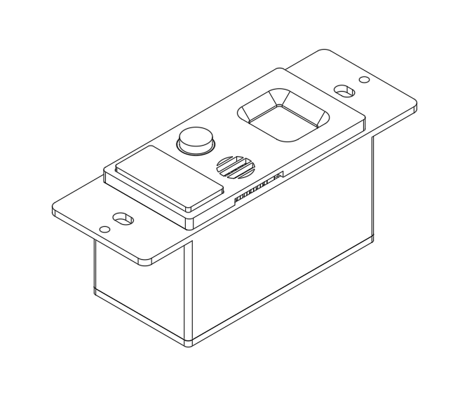

# Suitchi
DIY Smart Switch with HomeKit Support

## Features
- Motion/Occupancy Sensor
- Temperature & Humidity Sensor
- NO/NC Relay Switch
- OLED Status Screen

## Acknowledgements
This product was only possible with the help of the following OSS
- [Arduino HomeKit ESP8266](https://github.com/MixiaoxiaoArduino-HomeKit-ESP8266)
- [ThingPulse OLED SSD1306 (ESP8266/ESP32/Mbed-OS)](https://github.com/ThingPulse/esp8266-oled-ssd1306)
- [esp-homekit](https://github.com/maximkulkin/esp-homekit)