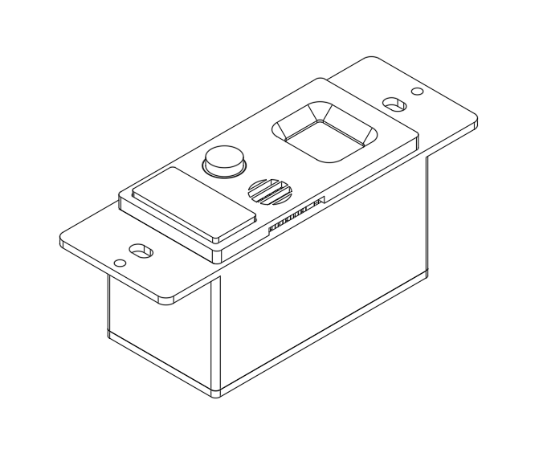

# Suitchi

DIY Smart Switch with HomeKit and Home Assistant support, built on the ESP8266.



## Features

- **Apple HomeKit** — native HomeKit bridge, no hub required. Exposes switch, temperature, humidity, motion, and occupancy as separate accessories
- **Home Assistant (MQTT)** — optional MQTT integration with autodiscovery. All entities appear automatically in HA with full bidirectional switch control
- **Motion & Occupancy Sensor** — PIR-based detection (MH-SR602) with instant HomeKit/MQTT notifications on state change
- **Temperature & Humidity Sensor** — DHT11 with heat index calculation, reported every 10 seconds
- **Relay Switch** — NO/NC relay controllable from HomeKit, Home Assistant, or the physical button
- **OLED Status Screen** — 64x48 SSD1306 display showing temperature, humidity, heat index, occupancy, and switch state. Only redraws on state changes to save I2C bandwidth
- **Physical Button** — single-click to toggle relay, long-press (5s) to reset HomeKit pairing and reboot
- **OTA Updates** — over-the-air firmware updates via ArduinoOTA with progress displayed on OLED
- **Relay State Persistence** — switch state is saved to EEPROM and restored on boot, so restarts don't change the light
- **Crash Resilience** — low-heap watchdog triggers a controlled restart before the device crashes. WiFi connection has a 30-second timeout with automatic reboot on failure
- **Remote Diagnostics** — HTTP `/status` endpoint and MQTT diagnostic sensors expose free heap, uptime, HomeKit client count, and last reset reason without needing serial access

## Hardware

| Component | Description |
|-----------|-------------|
| WeMos D1 Mini Pro V3.0 | ESP8266 MCU |
| MH-SR602 | PIR motion sensor |
| OLED LCD Shield 0.66" | SSD1306 64x48 I2C display |
| DHT11 | Temperature & humidity sensor |
| Wemos D1 Mini Relay Shield | NO/NC relay output |
| 110v-220v to 5v PSU | AC-DC power supply |
| OMRON 12x12x6mm | Tactile push button |

Full bill of materials with purchase links in [sch/README.md](sch/README.md). Schematic in [sch/](sch/), 3D-printable enclosure STLs in [stl/](stl/).

### Pin Assignments

| Pin | Function |
|-----|----------|
| D8 | Relay |
| D7 | Physical switch (INPUT_PULLUP) |
| D4 | DHT11 data |
| D3 | PIR motion sensor |
| SDA/SCL | OLED I2C |

## Setup

### Prerequisites

Install the following in Arduino IDE:

- **Board**: [ESP8266 board package](https://github.com/esp8266/Arduino)
- **Libraries**:
  - [Arduino-HomeKit-ESP8266](https://github.com/Mixiaoxiao/Arduino-HomeKit-ESP8266)
  - [esp8266-oled-ssd1306](https://github.com/ThingPulse/esp8266-oled-ssd1306)
  - DHT sensor library
  - [PubSubClient](https://github.com/knolleary/pubsubclient) (only if using MQTT)

### Configuration

Edit `src/suitchi/Constants.h`:

```c
#define homeKitPin "1CB8"
#define homeKitPassword "111-11-111"
#define bridgeName "Suitchi 1CB8"
#define otaName "suitchi_1CB8"
#define serialNumber "123457"
```

Edit `src/suitchi/wifi_info.h` with your WiFi credentials:

```c
const char *ssid = "YourSSID";
const char *password = "YourPassword";
```

### MQTT / Home Assistant (Optional)

To enable MQTT with Home Assistant autodiscovery, uncomment and configure in `Constants.h`:

```c
#define MQTT_ENABLED

#define MQTT_SERVER         "192.168.1.100"
#define MQTT_PORT           1883
#define MQTT_USER           ""
#define MQTT_PASS           ""
#define MQTT_NODE_ID        "suitchi_1cb8"
#define MQTT_TOPIC_PREFIX   "suitchi/1CB8"
#define MQTT_PUBLISH_INTERVAL 30000
```

Once connected, the device publishes discovery configs to `homeassistant/` and all entities appear automatically in Home Assistant grouped under a single device. The switch supports bidirectional control — toggling from HA, HomeKit, or the physical button keeps all three in sync.

### Build & Upload

1. Open `src/suitchi/suitchi.ino` in Arduino IDE
2. Select board **LOLIN(WeMos) D1 mini Pro**
3. Upload via USB for initial flash

Subsequent updates can be done over-the-air via ArduinoOTA.

## HTTP API

The device runs a web server on port 80:

| Endpoint | Description |
|----------|-------------|
| `GET /` | Welcome message |
| `GET /TH` | JSON temperature and humidity |
| `GET /motion` | JSON motion and occupancy state |
| `GET /status` | JSON free heap, HomeKit clients, uptime, and reset reason |

## MQTT Topics

When MQTT is enabled, the following topics are published under the configured prefix (e.g., `suitchi/1CB8/`):

| Topic | Type | Description |
|-------|------|-------------|
| `status` | Availability (LWT) | `online`/`offline` — set automatically by broker on disconnect |
| `temperature` | State (retained) | Temperature in °C |
| `humidity` | State (retained) | Humidity in % |
| `heat_index` | State (retained) | Heat index in °C |
| `motion` | State (retained) | `ON`/`OFF` |
| `occupancy` | State (retained) | `ON`/`OFF` |
| `switch` | State (retained) | `ON`/`OFF` |
| `switch/set` | Command | Send `ON`/`OFF` to control the relay |
| `heap` | Diagnostic | Free heap in bytes |
| `uptime` | Diagnostic | Seconds since boot |
| `reset_reason` | Diagnostic (retained) | Last ESP reset reason |

## License

[MIT](LICENSE)

## Acknowledgements

- [Arduino HomeKit ESP8266](https://github.com/Mixiaoxiao/Arduino-HomeKit-ESP8266)
- [ThingPulse OLED SSD1306](https://github.com/ThingPulse/esp8266-oled-ssd1306)
- [esp-homekit](https://github.com/maximkulkin/esp-homekit)
- [PubSubClient](https://github.com/knolleary/pubsubclient)
